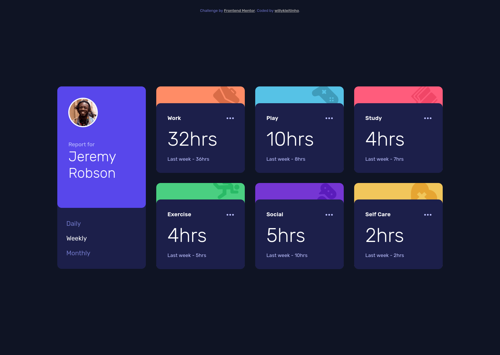

# Frontend Mentor - Time tracking dashboard solution

This is a solution to the [Time tracking dashboard challenge on Frontend Mentor](https://www.frontendmentor.io/challenges/time-tracking-dashboard-UIQ7167Jw). Frontend Mentor challenges help you improve your coding skills by building realistic projects. 

## Table of contents

- [Overview](#overview)
  - [The challenge](#the-challenge)
  - [Screenshot](#screenshot)
  - [Links](#links)
- [My process](#my-process)
  - [Built with](#built-with)
  - [What I learned](#what-i-learned)
  - [Continued development](#continued-development)
- [Author](#author)

## Overview

### The challenge

Users should be able to:

- View the optimal layout for the site depending on their device's screen size
- See hover states for all interactive elements on the page
- Switch between viewing Daily, Weekly, and Monthly stats
- Extra: add to the total number of hours

### Screenshot

### Links

- Solution URL: [on Frontend Mentor](https://www.frontendmentor.io/solutions/time-tracking-dashboard-with-css-grid-and-pure-js-state-management-F1eS-UyCU)
- Live Site URL: [on Github Pages](https://willykleitinho.github.io/time-tracking-dashboard/   )

## My process

### Built with

- Semantic HTML5 markup
- CSS custom properties
- Flexbox
- CSS Grid
- Mobile-first workflow
- State management
- [Font Awesome](https://fontawesome.com/) - Font icons

### What I learned

In this project, I created a class for representing each activity and storing each HTMLNode and its related data. I also practiced Flexbox, Grid, responsiveness and better structuring the HTML markup. 

### Continued development

I will learn more about data structures and state management. And soon I'll come back to this project and do it again!

## Author

- Github - [willykleitinho](https://github.com/willykleitinho)
- Frontend Mentor - [@willykleitinho](https://www.frontendmentor.io/profile/willykleitinho)
